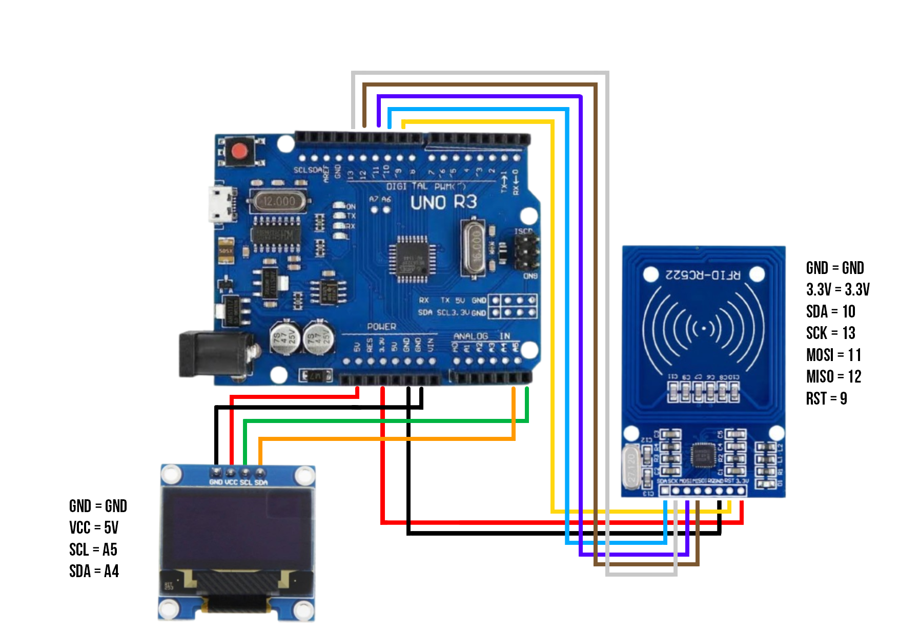

# 🔥Library 
<a href = "https://github.com/Michocfilm/MFRC-522"><kbd>🟢 MFRC-522</kbd></a> 
<a href = "https://github.com/Michocfilm/Adafruit-GFX-Library"><kbd>🟢 Adafruit_GFX</kbd></a> 
<a href = "https://github.com/Michocfilm/Adafruit_SH1106"><kbd>🟢 Adafruit_SH1106</kbd></a> 

# 🕯️What is Card copying machine
Card copying machine is a machine to copy NFC cards, MIFARE cards, and others card to make backup cards.

# 🕯️What is MFRC-522
The MFRC-522 is a highly **integrated reader/writer** IC for contactless communication at 13.56 MHz. It is commonly used in RFID (Radio Frequency Identification) systems and NFC (Near Field Communication) applications. Here are some key features and uses of the MFRC-522:

**Key Features**
 - Frequency: Operates at 13.56 MHz.
 - ISO/IEC Compliance: Compatible with ISO/IEC 14443 A/MIFARE and NTAG standards.
 - SPI Interface: Communicates via the Serial Peripheral Interface (SPI), making it easy to connect to microcontrollers.
 - Low Power Consumption: Designed to operate with low power consumption, making it suitable for battery-powered devices.
 - Programmable Communication Speed: Offers different communication speeds to adapt to various applications.
 - Internal Transmitters and Receivers: Integrates RF and analog circuits to minimize the need for external components.

**Common Uses**
 - Access Control Systems: Used in keycards and access badges to control entry to buildings and secure areas.
 - Payment Systems: Employed in contactless payment systems where transactions are done using cards or mobile devices.
 - Inventory Management: Helps in tracking products and assets in warehouses and retail environments.
 - Public Transportation: Utilized in transit passes and ticketing systems for buses, trains, and other public transport.
 - Identification: Applied in various identification systems, such as employee ID cards and event passes.

  

 

# ✨OLED
 - GND = GND
 - VCC = 5V
 - SCL = A5
 - SDA = A4
# ✨MFRC-522
 - GND  = GND
 - 3.3V = 3.3V
 - SDA  = 10
 - SCK  = 13
 - MOSI = 11
 - MISO = 12
 - RST  = 9
